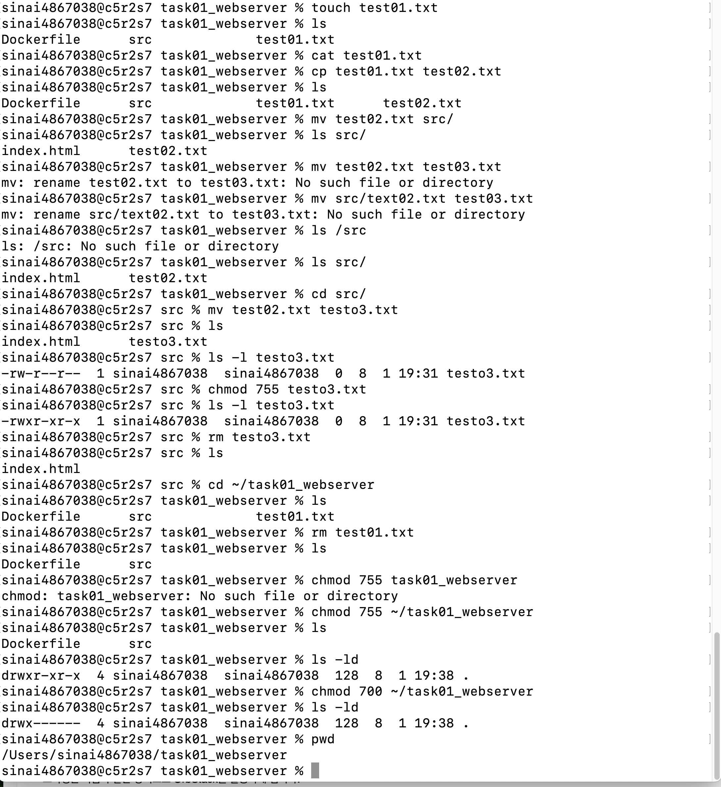
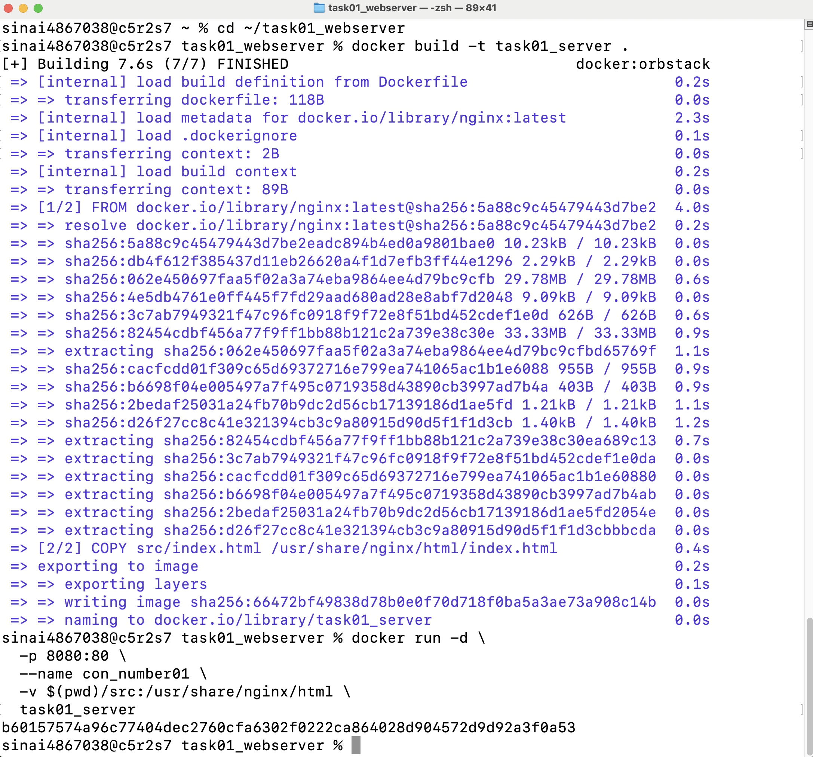
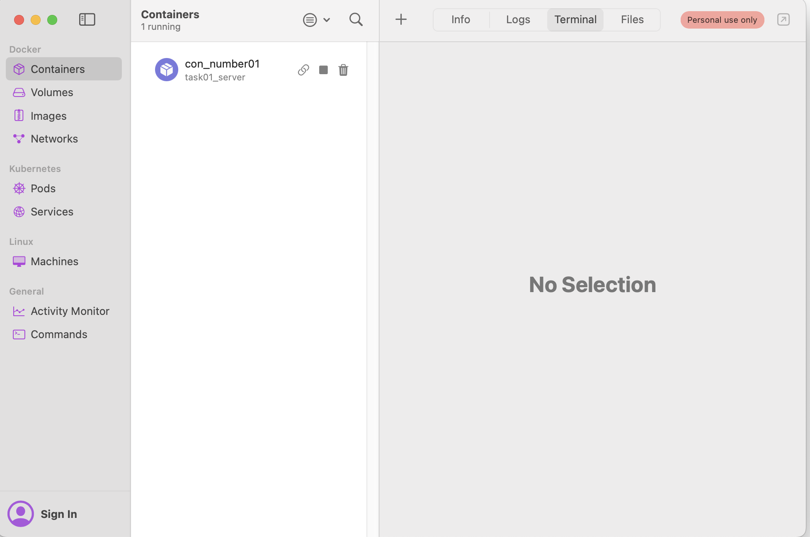
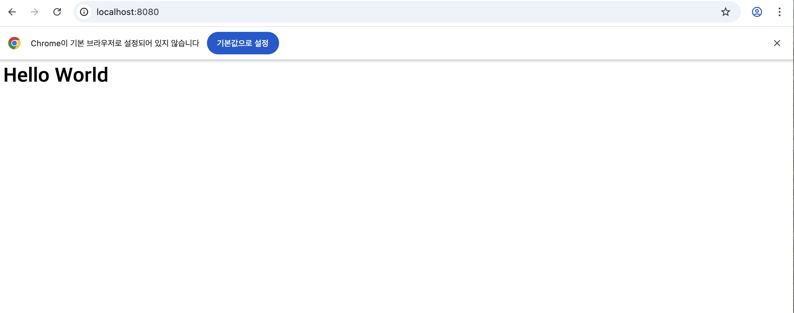
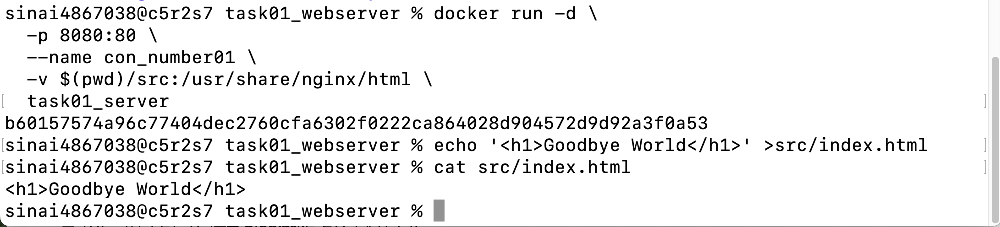
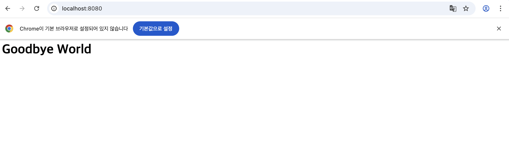
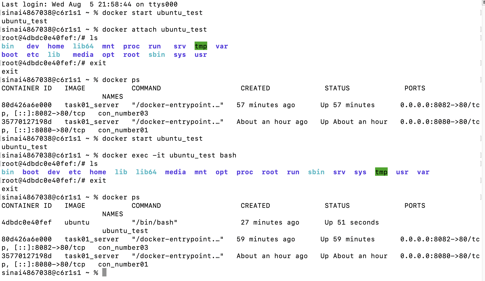
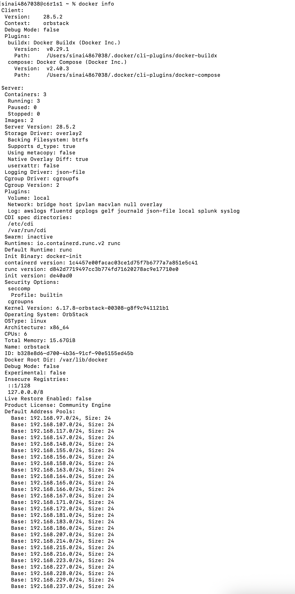

# 1. 프로젝트 개요
- GitHub 연동을 통해 다른 사람과 작업 진행 상황을 공유할 수 있도록 한다.
- docker를 사용하여 한 컴퓨터 내에서 각기 다른 환경에서 서비스 및 프로그램을 개발할 수 있는 지식을 갖춘다.
- Dockerfile과 포트 매핑 및 바인드마운팅 기능을 사용해서 서비스 내용의 변경이 있거나 삭제되는 상황이 발생하더라도 변경된 내용의 즉각 반영 및 기존 서비스 안정적으로 제공할 수 있는 환경 구축에 대해 학습한다.

# 2. 실행환경
- OS : macOS
- Shell : zsh
- Docker : 28.5.2
- Git : git version 2.53.0

# 3. 수행 항목 체크리스트
## 1) 작업 디렉토리와 권한 정리 (터미널에서 작업)
- 작업용 디렉토리 생성 : mkdir ~/task01_webserver
- 생상한 디렉토리로 이동 : cd ~/task01_webserver
- 테스트용 빈 파일 생성 : touch test01.txt
- 파일 내용 확인 : cat test01.txt
- 파일 복사 : cp test01.txt test02.txt
- 파일 이동 : mv test02.txt src/
- 파일 이름 변경 : mv test02.txt test03.txt
- 현재 위치 확인 : pwd
- 디렉토리 내에서 목록 확인 : ls src/
- 파일 권한 확인 : ls -l test03.txt
- 결과 : -rw-r--r-- 1 sinai4867038 sinai4867038 0 8 1 19:31 test03.txt
- 파일 권한 변경 : chmod 755 test03.txt
- 결과 : -rwxr-xr-x 1 sinai4867038 sinai4867038 0 8 1 19:31 test03.txt
- 파일 삭제 : rm test03.txt
- 디렉토리 권한 정리 : chmod 755 ~/task01_webserver (755 : 소유자는 모든 권한, 다른 사람은 읽기/실행만 가능)
- 디렉토리의 권한 확인 : ls -ld ~/task01_webserver (ls -ld : 폴더 자체의 정보와 권한을 보여줌)
- 권환 확인 결과와 설명 :
drwxr-xr-x 2 sinai4867038 sinai4867038 64 8 1 17:06 /Users/sinai4867038/task01_webserver
    -> 결과 설명 drwxr-xr-x → 권한 (d = 디렉토리, rwx = 읽기/쓰기/실행) 2 → 링크 수 sinai4867038 → 소유자 sinai4867038 → 그룹 64 → 디렉토리 크기(바이트 단위) 8 1 15:06 → 마지막 수정 시간 (8월 1일 17시 06분) /Users/sinai4867038/task01_webserver → 디렉토리 경로
- 디렉토리 권한 수정 : chmod 700 ~/task01_webserver (원래 권한은 755)
- 디렉토리 권한 수정 결과 : drwx------ 4 sinai4867038 sinai4867038 128 8 1 19:38 .

## 2) docker 설치, 점검 및 컨테이너 실행 관리
- docker 설치 : brew install --cask docker
- 권한 문제로 설치 실패

- 해결 방법 : 맥북 내 Orbstatk 앱 활성화 후 터미널에서 docker version 명령어를 사용해 사용가능한 상태 및 버전 확인 완료 

## 3) Dockerfile 작업
- 현재 디렉토리 안에 하위 디렉토리 생성 : mkdir src
- 웹서버용 파일 생성 : echo "Hello Wolrd" > src/index.html
- Dockerfile 만들기 :
### echo "FROM nginx:latest" > Dockerfile 
### (첫줄은 반드시 각진 괄호 1개. Dockerfile에 괄호 왼쪽 내용을 넣는다는 뜻)
### echo "COPY src/index.html /usr/share/nginx/html/index.html" >> Dockerfile
### echo "EXPOSE 80" >> Dockerfile (괄호가 2개면 앞 내용에 이어쓴다는 의미. 1개면 덮어쓴다는 의미. 첫줄만 괄호 1개여야 한다)
- Dockerfile 에 내용이 제대로 들어갔는지 확인 : cat Dockerfile
- 결과 : 
### FROM nginx:latest
### COPY src/index.html /usr/share/nginx/html/index.html
### EXPOSE 80

## 4) 포트 매핑 및 바인드 마운트
- 포트 매핑 : 컨테이너가 정상적으로 실행되고 웹페이지가 보이는지 확인하는 단계
- 바인드 마운트 : 호스트의 파일을 컨테이너와 직접 공유하는 작업. 파일을 수정할 경우 바로 컨테이너에 반영되므로 개발 단계에서 확인 작업에 사용하면 좋음
- docker build : docker build -t task01_server .

- docker 포트 매핑 및 바인드 마운트 작업 :
docker run -d -p 8080:80 --name con_number01 -v $(pwd)/src:/usr/share/nginx/html task01_server
- 결과 : b60157574a96c77404dec2760cfa6302f0222ca864028d904572d9d92a3f0a53
- d는 뒤에서 작업하겠다는 의미, p는 포트 매핑(맥북의 8080포트와 dockerfile에서 설정한 80포트를 연결), name은 컨테이너 이름, v는 src 디렉토리 내의 파일과 바인드마운팅 한다는 의미, task01_server 는 docker가 생성한 이미지 이름
- 포트 매핑 확인 : http://localhost:8080/ 접속 

### **< 비어있던 컨테이너에 이름을 부여한 컨테이너 생성 확인 >**

### **< 포트 매핑 확인을 위한 로컬호스트 8080 웹주소 이미지 >**

- 바인드마운트 확인 위해 index.html 파일 내용 변경 : 
### echo 'Goodbye World' >src/index.html
- 파일 변경 내용 확인 : cat src/index.html
- 변경 내용 적용 확인 : http://localhost:8080/ 새로 고침 

### **< index.html 수정 >**

### **< 로컬호스트 8080 새로 고침 결과 화면 >**

- 컨테이너 삭제 전후로 데이터 확인해서 데이터 유지됨 확인

## 5) 볼륨 작업(volume : docker가 관리하는 저장공간)
- docker 볼륨 생성 : docker volume create con_01_volume
- 생성 결과 : con_01_volume
- 생성된 볼륨 리스트 확인 : docker volume ls
- 실행 결과 :
### DRIVER VOLUME NAME
### local con_01_volume
- 볼륨 상세 정보 확인 명령어 :docker volume inspect con_01_volume
- 실행 결과 :\ [ { "CreatedAt": "2026-08-05T20:46:31+09:00", "Driver": "local", "Labels": null, "Mountpoint": "/var/lib/docker/volumes/con_01_volume/_data", "Name": "con_01_volume", "Options": null, "Scope": "local" } ]
- 생성한 볼륨과 새로운 컨테이너 연결(새로운 포트로 포트매핑) : docker run -d --name con_number02 -p 8081:80 -v con_01_volume:/usr/share/nginx/html task01_server
(task01_server 이미지를 이용해 con_number02라는 컨테이너를 생성하고, 그 컨테이너의 /usr/share/nginx/html 폴더를 con_01_volume 볼륨과 연결한다)
- 볼륨 연결한 컨테이너 상세 정보 : docker inspect con_number
- 컨테이너 내부 확인 : docker exec con_number02 ls -l /usr/share/nginx/html (con_number02 컨테이너 안에 들어가서 /usr/share/nginx/html 폴더 안에 어떤 파일들이 있는지 상세 정보까지 보여줘)
- 실행 결과 : total 8 -rw-r--r-- 1 root root 497 Jul 15 16:03 50x.html -rw-r--r-- 1 root root 12 Aug 5 11:34 index.html
- 컨테이너 삭제 : docker rm -f con_numver02
- 새 컨테이너 생성 및 같은 볼륨 연결 : docker run -d --name con_number03 -p 8082:80 -v con_01_volume:/usr/share/mnginx/html task01_server
- 새로 생성한 컨테이너 내부 확인 : docker exec con_number03 ls -l /usr/share/nginx/html
- 새로 생성한 컨테이너 내부 파일 내용 확인 : docker exec con_number03 cat /usr/share/nginx/html/index.html

## 6) 컨테이너 테스트
- 우분투 컨테이너 생성 : docker pull ubuntu
- 결과 : Using default tag: latest latest: Pulling from library/ubuntu 617772c7d19b: Pull complete a7fb98a8eddd: Pull complete Digest: sha256:678c6550cc43645e08669028bc177f50be4e7c5b8cca677067b1914d4afc7a03 Status: Downloaded newer image for ubuntu:latest docker.io/library/ubuntu:latest
- 컨테이너 실행 : docker run -it --name ubuntu_test ubuntu
- 결과 : root@4dbdc0e40fef:
- 컨테이너 내부 진입 후 목록 확인 : ls
- 결과 : bin dev home lib64 mnt proc run srv tmp var
boot etc lib media opt root sbin sys usr\
- 우분투 재시작 후 attach 명령어 사용 : docker start ubuntu_test -> docker attach ubuntu_test
- attach 일 떄 컨테이너 상태 : docker ps
- 우분투 종료 후 다시 우분투 시작 : docker start ubuntu_test
- exec 명령어로 상태 확인 : docker exec -it ubuntu_test bash
- ps 명령어로 상태 확인 : docker ps
- attach / exec 를 각각 사용했을 때 결과값이 다름. attach가 메인 프로세스가 종료되면 컨테이너도 함께 종료되는 것으로 보아 실행 중인 컨테이너의 메인 프로세스에 직접 연결된다는 것을 알 수 있다. exec는 exit를 입력해도 생성한 쉘만 종료되고 컨테이너는 계속 실행되는 것으로 보아(시간에 second가 찍히면서 직전까지 실행되고 있음을 확인할 수 있다.) 실행 중인 컨테이너 내부에서 새로운 프로세스를 생성하여 명령을 실행한다는 것을 알 수 있다. 

## 7). 도커 데몬 동작 여부 확인 결과 기록(info) 과 결과
- 명령어 : docker info

